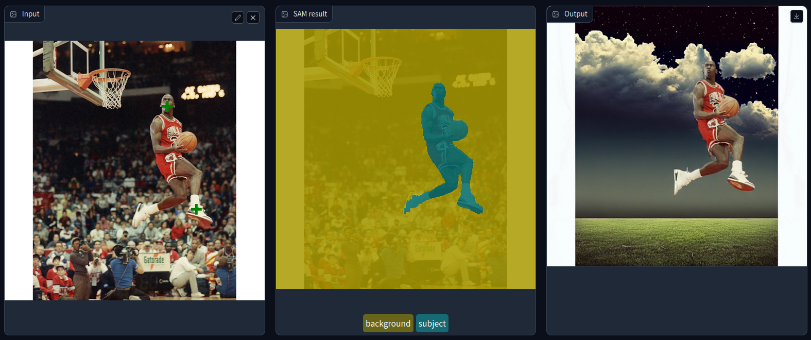

# Project 3: AI Photo Editing with Inpainting  <a class="jp-toc-ignore"></a>

## Project Introduction <a class="jp-toc-ignore"></a>
In this project, you will build an interactive AI-powered photo editing application that combines state-of-the-art generative models for computer vision. The app enables users to swap the background of a subject in an image with a computer-generated scene described via text, or replace the subject itself while preserving the original background. This is achieved by integrating the Segment Anything Model (SAM) for precise object segmentation and a diffusion-based inpainting model for realistic image generation based on user prompts.

The challenge is to create an intuitive workflow where users can upload an image, select the main subject by clicking on it, and then use generative AI to transform either the background or the subject according to their creative vision. This project demonstrates the power of promptable segmentation and text-to-image diffusion models for creative and practical image manipulation tasks.

## Key Features of the Application <a class="jp-toc-ignore"></a>
- Interactive Subject Selection: Users upload an image and identify the primary object by clicking on it. The Segment Anything Model (SAM) generates a segmentation mask around the selected subject, which can be refined interactively for greater accuracy.
- Flexible Mask Refinement: The app allows users to accept or further refine the generated mask by adding more points, ensuring precise segmentation.
- Text-to-Image Generation: After finalizing the mask, users provide a text prompt (and optionally, a negative prompt) describing the desired new background or subject. The diffusion inpainting model uses this prompt to generate a realistic replacement.
- Background or Subject Substitution: Users can choose to either swap out the background while keeping the subject, or invert the mask to replace the subject and retain the background.
- Versatile Image Editing: The app supports background substitution, subject substitution, object removal, and creative compositing, making it suitable for a variety of image editing needs.

## Using Inpainting App
Below we have a picture that was edited using the Inpainting App. It illustrates Michael Jordan about to dunk (original picture `mj.png`), and it was edited using the following prompt:
```
Replace background with a sky full of clouds
```
